<p align="center">
  <picture>
    <source media="(prefers-color-scheme: dark)" srcset="docs/media/readme/wordmark-dark.png">
    
  </picture>
</p>

<h3 align="center">The free, open source live video mixer you can run from a browser, a phone, or by asking an AI.</h3>

<p align="center">
  Cameras, phones, graphics and web pages in, one programme out to YouTube, Facebook, Twitch and your own site at the same time.<br>
  When a camera dies mid show, your stream stays up.
</p>

<p align="center">
  <a href="https://github.com/psmux/GodwinMix/releases/latest"></a>
  <a href="https://github.com/psmux/GodwinMix/releases"></a>
  <a href="LICENSE"></a>
  
  
</p>

<p align="center">
  <a href="https://github.com/psmux/GodwinMix/releases/latest"><b>Download for Windows</b></a> ·
  <a href="https://github.com/psmux/GodwinMix/releases/latest"><b>macOS</b></a> ·
  <a href="https://github.com/psmux/GodwinMix/releases/latest"><b>Linux</b></a> ·
  <a href="#run-it-on-a-server"><b>Docker</b></a> ·
  <a href="#connect-your-agent"><b>Connect your AI agent</b></a> ·
  <a href="https://godwinmix.ripeflow.com/"><b>Website</b></a>
</p>

<p align="center">
  <a href="docs/media/readme/video/hero.mp4">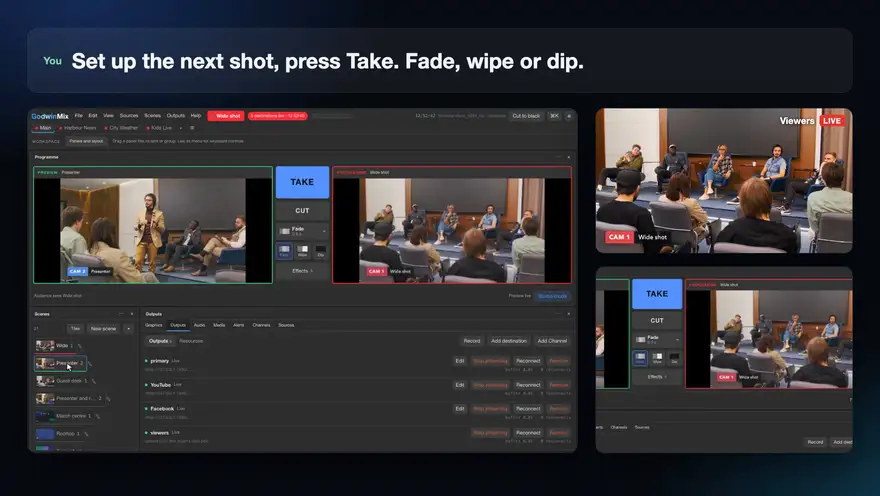</a>
  <br>
  <sub>Every frame is the real app and its real output. <a href="docs/media/readme/video/hero.mp4">Watch it in HD</a>.</sub>
</p>

## Go live in three steps

1. **Download** the app for [Windows, macOS or Linux](https://github.com/psmux/GodwinMix/releases/latest) and open it. No account, nothing else to install.
2. **Say what you are streaming.** A church service, a classroom, a game stream or an empty desk. Change anything later.
3. **Paste your stream key and press Take.** YouTube, Facebook, Twitch or any RTMP address. It turns green and you are live.

<p align="center">
  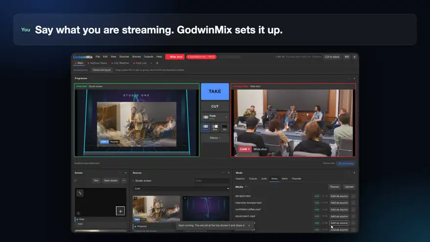
</p>

## Tell it what you want

GodwinMix has an MCP server built in, so Claude Code, Codex, Gemini CLI, Cursor or any MCP client can run your show. You ask for the outcome in plain words. The agent picks the graphic, fills it in, builds the scene, takes it to air and checks the programme picture before it answers.

Every clip below is a real session with the waits shortened and account details blanked: the prompt as it was typed, the agent's own reply, and what viewers saw at that moment. Loops play at 2x; click one for the full session in HD.

<table>
<tr>
<td width="50%" valign="top">
<a href="docs/media/readme/video/breaking.mp4">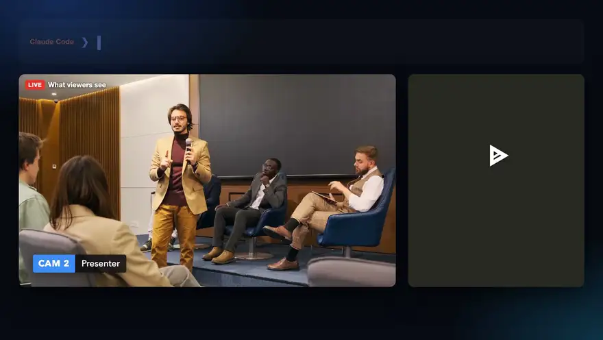</a>
<b>Put breaking news on air</b><br>
<code>Show a red breaking news bar on air: Coast road closed at Fairlight.</code><br>
<code>Change the headline to: Coast road reopened.</code>
</td>
<td width="50%" valign="top">
<a href="docs/media/readme/video/broken.mp4">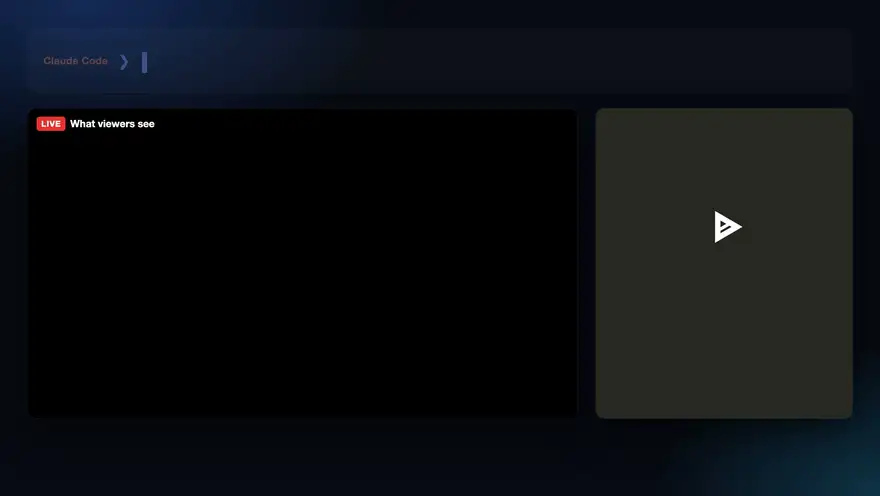</a>
<b>Find what is broken and fix it</b><br>
<code>Is anything wrong with the show right now?</code><br>
<sub>Camera 3 had died on air. The agent saw it, said viewers were getting dead air, and cut back to the presenter.</sub>
</td>
</tr>
<tr>
<td valign="top">
<a href="docs/media/readme/video/score.mp4"></a>
<b>Keep the score on screen, live</b><br>
<code>Put a Harbour City v Northfield score bug on air and keep it updated from http://127.0.0.1:8765/score.json</code><br>
<sub>A goal went into the feed. The bug changed to 3 to 1 on its own.</sub>
</td>
<td valign="top">
<a href="docs/media/readme/video/speaker.mp4">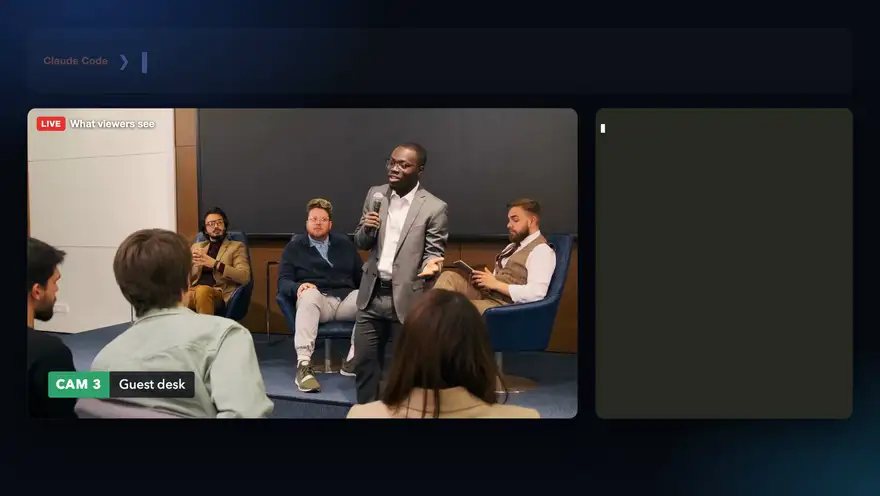</a>
<b>Introduce the next speaker</b><br>
<code>Show Ana Silva, Product Director, as a lower third in #0066cc over this shot.</code>
</td>
</tr>
<tr>
<td valign="top">
<a href="docs/media/readme/video/panel.mp4">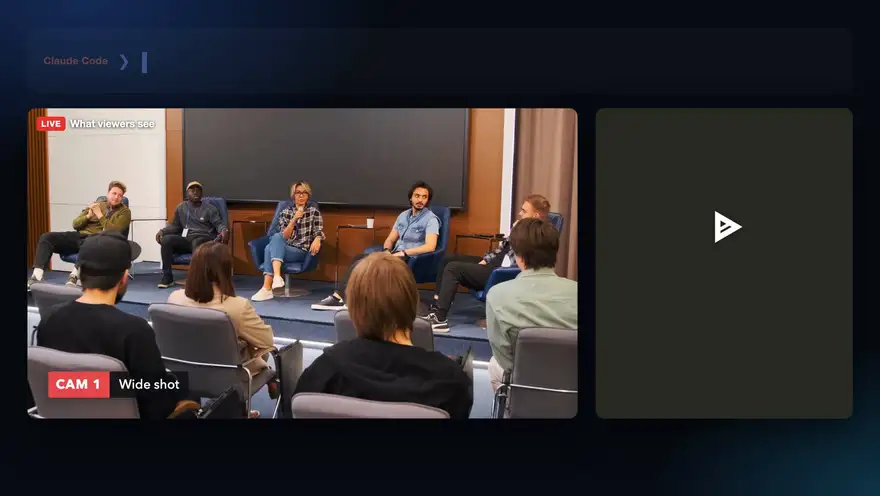</a>
<b>Put the whole panel on screen</b><br>
<code>Put the three panel cameras side by side and take it live.</code>
</td>
<td valign="top">
<a href="docs/media/readme/video/countdown.mp4"></a>
<b>Start on time</b><br>
<code>Make a starting soon screen that counts down two minutes, and put it on air.</code>
</td>
</tr>
<tr>
<td valign="top">
<a href="docs/media/readme/video/hymn.mp4">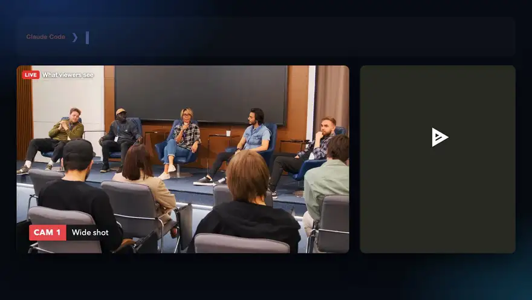</a>
<b>Words for the congregation at home</b><br>
<code>Put the hymn words over the wide shot and take it live.</code>
</td>
<td valign="top">
<a href="docs/media/readme/video/sponsor.mp4"></a>
<b>Roll the sponsor, come back on cue</b><br>
<code>Play the Northfield Coffee sponsor clip, then come back to the wide shot.</code>
</td>
</tr>
</table>

### More prompts to try

| For | Ask your agent |
|---|---|
| Church | `Show Pastor Grace, Sunday Service, in white on #173b64.` |
| Church | `Direct these church cameras for one minute. Hold each shot at least eight seconds.` |
| School | `Put my camera beside the lesson slides and take that layout live.` |
| School | `Put "Water boils at 100°C at sea level" over my lesson.` |
| Sports | `Show Falcons 2, Rovers 1, second half, over the match.` |
| News | `Run headlines from our community RSS feed along the bottom.` |
| Events | `Show Ana Silva, Product Director, in #0066cc over the webinar.` |
| Streamers | `Put my webcam over the game, bottom right, with a purple frame.` |
| Podcasts | `Put both podcast cameras side by side with our names, Jo and Sam.` |
| 24x7 channels | `Watch for one minute; if the programme freezes, take the healthy backup.` |
| Channel operators | `Dry run feeds.csv, then start the channels that fit this machine.` |
| Developers | `Turn the Python colour bars example into a clock source and put it on air.` |

## Or run it yourself

Everything the agent does is a button you can press. These are real recordings of the app beside what viewers got.

<table>
<tr>
<td width="50%" valign="top">
<a href="docs/media/readme/video/camera-dies.mp4">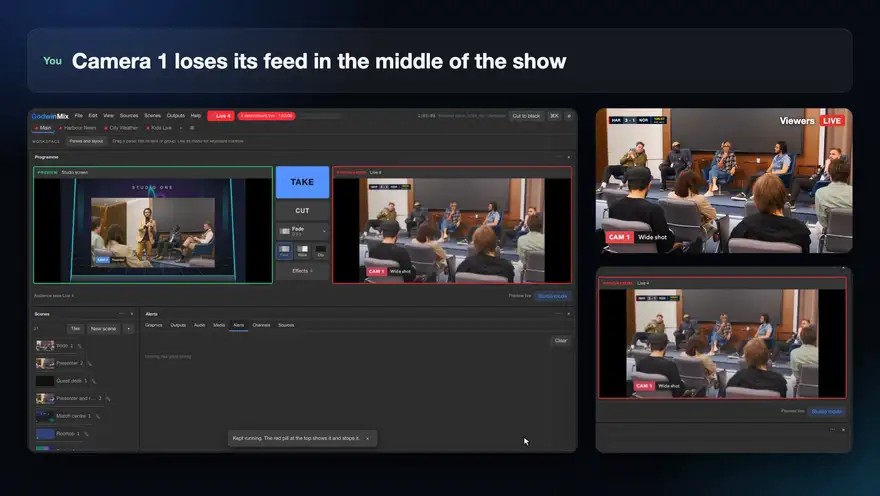</a>
<b>A camera dies. Your stream stays up.</b><br>
<sub>Viewers see the slate under your graphics, the match clock keeps running, the operator gets an alert, and the picture comes back by itself. Nothing restarts and YouTube never sees a reconnect.</sub>
</td>
<td width="50%" valign="top">
<a href="docs/media/readme/video/phone.mp4">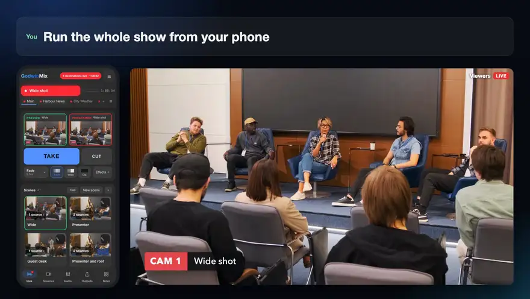</a>
<b>Run the whole show from your phone</b><br>
<sub>Phones get their own layout of the same app: preview, programme, Take, Cut and every scene. A second operator can join from their own device.</sub>
</td>
</tr>
<tr>
<td valign="top">
<a href="docs/media/readme/video/destinations.mp4">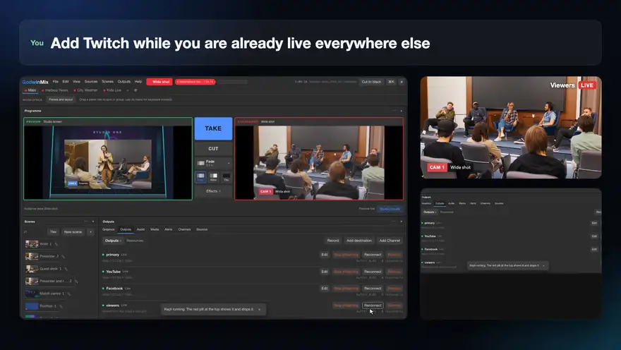</a>
<b>Every destination at once, built in</b><br>
<sub>Add Twitch while you are already live on YouTube and Facebook, with a watch link and QR code for your own site. No plugin, no relay service.</sub>
</td>
<td valign="top">
<a href="docs/media/readme/video/wall.mp4">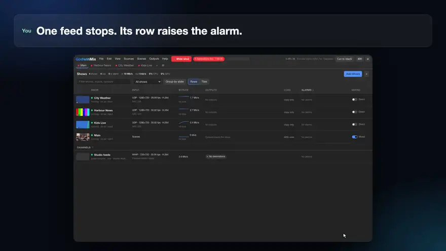</a>
<b>Watch every channel on one wall</b><br>
<sub>Run several shows from one machine. When a feed stops, its row raises the alarm and the others carry on.</sub>
</td>
</tr>
</table>

More of the app, with narration: [the website tour](https://godwinmix.ripeflow.com/).

## Why people switch

* It is free for any use, including commercial, under Apache 2.0, on Windows, macOS and Linux.
* A dead camera or a dropped destination does not take your stream down. The part that sends your picture out starts once and runs until the show ends.
* Multistreaming, phone cameras by link or QR and the browser UI come with it, and NDI and SRT are first party plugins in the installer.
* Anyone on the team can run the show from a browser, a tablet or a phone, several people at once, each with their own undo for scene edits.
* Your AI agent can operate it, design its graphics and keep watch, through the MCP server that ships in the same binary.
* It runs headless on a server, in Docker or on a Raspberry Pi, as well as on a laptop.
* Your OBS scene collection comes across, with a report of anything it skipped.

## Find your way in

| You are | Start here |
|---|---|
| A church media team, a teacher, a club or a small event crew | [Download the app](https://github.com/psmux/GodwinMix/releases/latest), then [your first stream](docs/tutorials/first-stream-desktop.md) |
| Coming from OBS | [Bring your OBS scene collection across](docs/how-to/import-from-obs.md) |
| Running shows with a team | [Run a show from phones](docs/how-to/run-a-show-from-phones.md), [several operators](docs/how-to/operate-with-several-people.md), [Companion and Stream Deck](docs/how-to/companion-and-streamdeck.md), [OSC and tally](docs/how-to/osc-and-tally.md) |
| Running channels on a server | [Run it on a server](#run-it-on-a-server), [monitor many shows](docs/how-to/monitor-many-shows.md), [Raspberry Pi](docs/how-to/raspberry-pi.md) |
| Building with AI agents | [Connect your agent](#connect-your-agent) |
| Scripting it | [Drive it from the command line](#drive-it-from-the-command-line) |
| A developer who wants to embed or extend it | [Build on it](#build-on-it) |

## Connect your agent

With GodwinMix open on the same machine, your agent needs no address and no token.

```sh
claude mcp add godwinmix -- godwinmix mcp
godwinmix skill install --for claude     # or opencode, pi, codex, gemini
```

Or skip the terminal: **Help > Connect an AI agent** in the app has a Set up button for Claude Code, opencode, pi, Codex, Gemini CLI, Cursor and VS Code.

<p align="center">
  
</p>

The agent sees the whole show in one labelled picture, every camera plus the programme, so it compares shots in a single look before it acts.

<p align="center">
  
</p>

The playbook for agents is [docs/agents.md](docs/agents.md). A working director built on the Anthropic SDK is [examples/ai-director.py](examples/ai-director.py). Setup per agent: [connect an AI agent](docs/how-to/connect-an-ai-agent.md).

## Run it on a server

One container, one port, no screen. This puts a web page on air to a local RTMP server, so it needs no stream key to try.

```sh
git clone https://github.com/psmux/GodwinMix && cd GodwinMix
docker compose -f deploy/docker/docker-compose.yml up -d --build
```

Open <http://localhost:8080> for the mixer and <http://localhost:8888/live/program> to watch what goes out. To stream somewhere real:

```sh
docker run -d --name godwinmix --shm-size 1g \
  -p 127.0.0.1:8080:8080 -e GODWINMIX_TOKEN=change-me \
  ghcr.io/psmux/godwinmix:latest
```

The full walk through is [your first stream with Docker](docs/tutorials/first-stream-docker.md). Before the port is reachable from anywhere else, read [deploy/README.md](deploy/README.md) for the token, TLS and the firewall.

## Drive it from the command line

Everything the window does is one call, and `gmx` is the short command for it.

```sh
gmx ctl status
gmx ctl source add roof https://host/stream.m3u8 --name "Roof camera"
gmx ctl output add youtube rtmp://a.rtmp.youtube.com/live2/KEY
gmx ctl take roof
```

Every command is in the [CLI reference](docs/reference/cli.md) and every endpoint in the [HTTP API reference](docs/reference/http-api.md).

## Build on it

GodwinMix is one Rust binary on GStreamer. The same binary is the server, the CLI and the MCP server, and the web UI uses the same public API as everyone else.

* Embed the engine in your own program with `cargo add godwinmix-core`: [how to embed it](docs/how-to/embed-the-engine.md).
* Write a plugin that runs beside the core: [your first plugin](docs/tutorials/your-first-plugin.md), scaffolded by `gmx plugin new`.
* Theme the UI with CSS variables: [add a theme](docs/how-to/add-a-theme.md).
* API level 1 is frozen for breaking changes, and an old level stays supported for a year after a new one.

Start with [CONTRIBUTING.md](CONTRIBUTING.md) and the [architecture](docs/explanation/architecture.md). The measured results, the pipeline, platforms and hardware are in [technical details](docs/technical-details.md) and [why the programme never stops](docs/explanation/why-the-programme-never-stops.md).

## Documentation

| | |
|---|---|
| [Tutorials](docs/tutorials/) | your first stream on the desktop, in a browser, with Docker or from a preset |
| [How to](docs/how-to/) | one task each: graphics, phones, ad breaks, screen capture, NDI, SRT, monitoring many shows |
| [Reference](docs/reference/) | sources, the HTTP API, the CLI, plugins, presets |
| [Explanation](docs/explanation/) | why GodwinMix is built the way it is |
| [Technical details](docs/technical-details.md) | install paths in depth, verification, hardware, platforms and known limits |

## Licence

Apache 2.0, in [LICENSE](LICENSE). Contributions are under the
[CLA](CLA.md) and the [code of conduct](CODE_OF_CONDUCT.md). Security reports
go to the address in [SECURITY.md](SECURITY.md), not to a public issue.

GodwinMix is not affiliated with, endorsed by or connected to the OBS Project.
OBS, OBS Studio, Open Broadcaster Software and the OBS Studio logo are
registered trademarks of Wizards of OBS LLC, and are used here only to describe
what this software reads.

Upgrading from LiveboxMix, which is what this was called until 0.2:
[docs/how-to/upgrade-from-liveboxmix.md](docs/how-to/upgrade-from-liveboxmix.md).
