<p align="center">
  <picture>
    <source media="(prefers-color-scheme: dark)" srcset="docs/media/readme/wordmark-dark.png">
    
  </picture>
</p>

<h3 align="center">A free, open source live video mixer that one person can run.</h3>

<p align="center">
  Cameras, phones, guests, graphics and web pages in one window.<br>
  Press Take, and the show goes to YouTube, Facebook and anywhere else at the same time.
</p>

<p align="center">
  <a href="https://github.com/psmux/GodwinMix/releases/latest"></a>
  <a href="https://github.com/psmux/GodwinMix/releases"></a>
  <a href="LICENSE"></a>
  
</p>

<p align="center">
  <a href="https://github.com/psmux/GodwinMix/releases/latest"><b>Download for Windows</b></a> ·
  <a href="https://github.com/psmux/GodwinMix/releases/latest"><b>macOS</b></a> ·
  <a href="https://github.com/psmux/GodwinMix/releases/latest"><b>Linux</b></a> ·
  <a href="#run-it-on-a-server"><b>Docker</b></a> ·
  <a href="#hook-it-to-an-ai-agent"><b>AI agents</b></a> ·
  <a href="https://godwinmix.ripeflow.com/"><b>Website</b></a>
</p>

<p align="center">
  <a href="https://godwinmix.ripeflow.com/media/video/godwinmix-overview.mp4">
    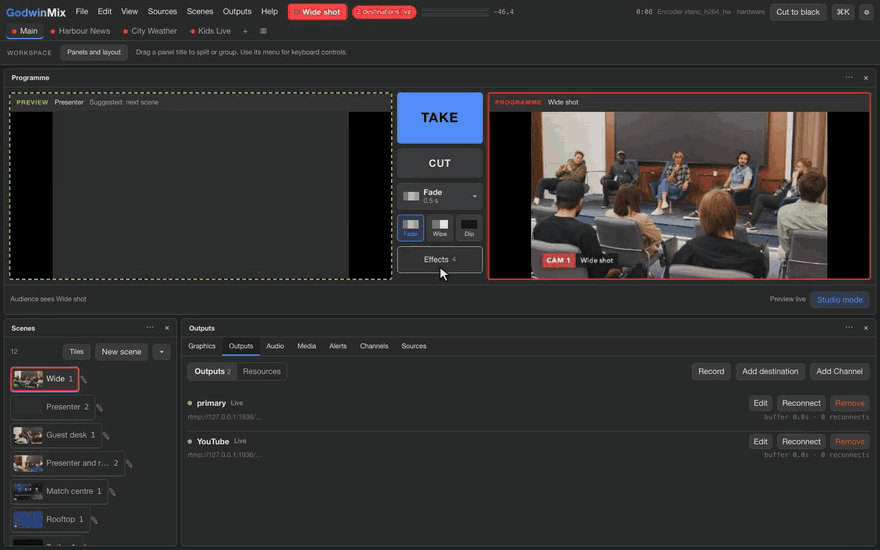
  </a>
  <br>
  <sub>One person, one window, a whole live show. <a href="https://godwinmix.ripeflow.com/media/video/godwinmix-overview.mp4">Watch the 36 second overview with sound</a>.</sub>
</p>

## Go live in three steps

1. **Download** the app for [Windows, macOS or Linux](https://github.com/psmux/GodwinMix/releases/latest) and open it. There is no account and nothing else to install.
2. **Pick a starting point.** The welcome screen offers ready setups for a church service, a classroom, a game stream and more. Change anything later.
3. **Add your stream key and press Take.** Paste the address YouTube, Facebook or Twitch gives you under Add destination. It turns green and you are live.

<p align="center">
  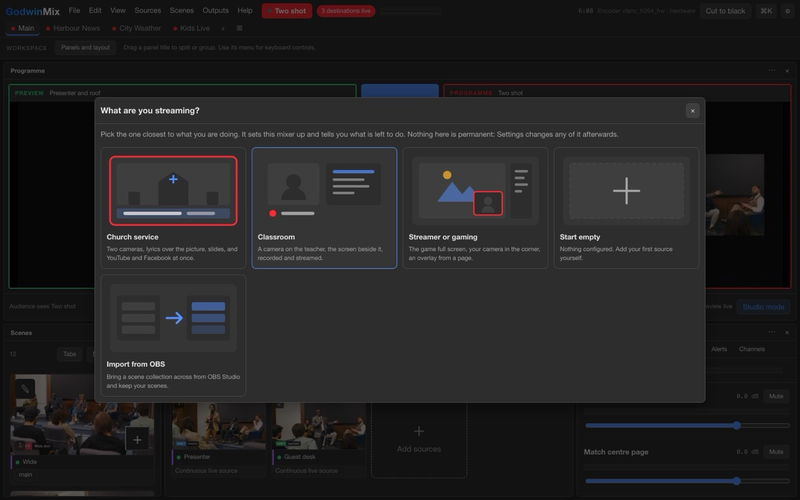
</p>

The full walk through, with screenshots, is [your first stream on the desktop app](docs/tutorials/first-stream-desktop.md). Fifteen minutes, one camera, one destination.

## What you can do with it

Every clip below is the real app, recorded live. Click any of them to watch the narrated film.

<table>
<tr>
<td width="50%" valign="top">
<a href="https://godwinmix.ripeflow.com/media/video/sunday-service.mp4">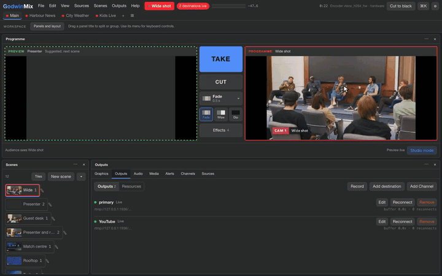</a>
<b>Set up the next shot, then Take</b><br>
<sub>Preview on the left, what viewers see on the right. A fade carries them across.</sub>
</td>
<td width="50%" valign="top">
<a href="https://godwinmix.ripeflow.com/media/video/sunday-service.mp4">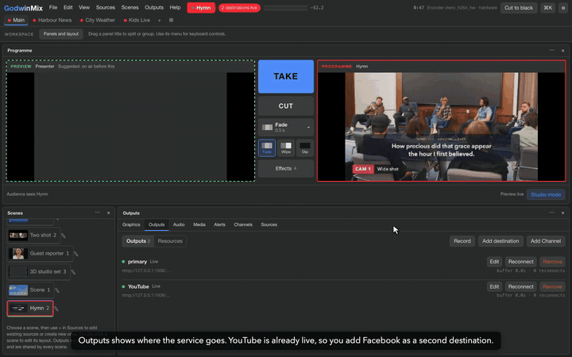</a>
<b>YouTube and Facebook at the same time</b><br>
<sub>Add a second destination while you are live, and record a copy on your own computer.</sub>
</td>
</tr>
<tr>
<td valign="top">
<a href="https://godwinmix.ripeflow.com/media/video/phone-and-guest.mp4">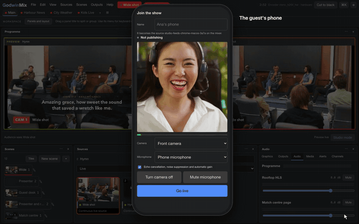</a>
<b>A guest joins from their phone</b><br>
<sub>Send a link or show a QR code. No app to install, no account to make.</sub>
</td>
<td valign="top">
<a href="https://godwinmix.ripeflow.com/media/video/graphics-and-set.mp4">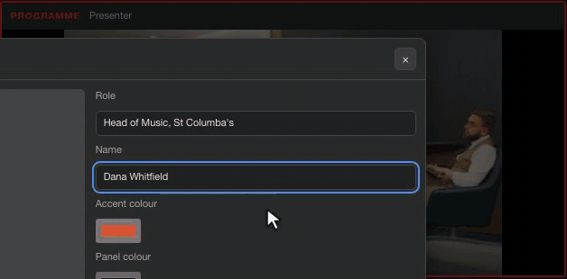</a>
<b>Names, tickers and logos on screen</b><br>
<sub>Type a name into a ready lower third and it slides in over the live picture.</sub>
</td>
</tr>
<tr>
<td valign="top">
<a href="https://godwinmix.ripeflow.com/media/video/sunday-service.mp4">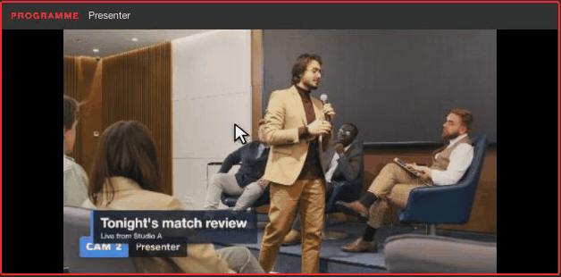</a>
<b>Song words over the room</b><br>
<sub>Lyrics sit over the camera and move on with each verse, so people at home sing along.</sub>
</td>
<td valign="top">
<a href="https://godwinmix.ripeflow.com/media/video/sunday-service.mp4">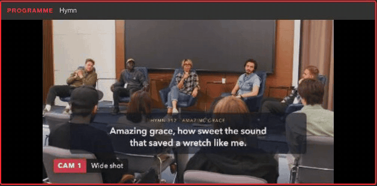</a>
<b>A camera dies, the show goes on</b><br>
<sub>Viewers see a slate instead of an error, an alert names the camera, and the picture comes back by itself.</sub>
</td>
</tr>
<tr>
<td valign="top">
<a href="https://godwinmix.ripeflow.com/media/video/graphics-and-set.mp4">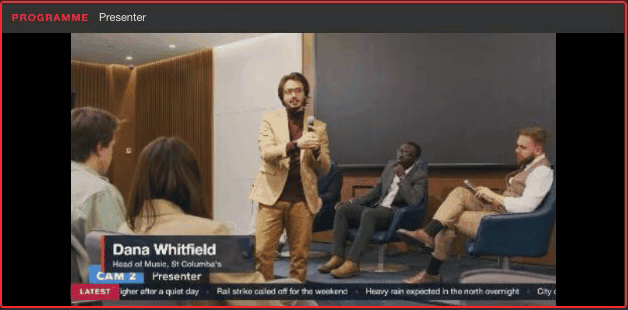</a>
<b>A 3D studio behind your presenter</b><br>
<sub>Virtual sets, transitions with moving previews and effects over whatever is on air.</sub>
</td>
<td valign="top">
<a href="https://godwinmix.ripeflow.com/media/video/take-and-adbreak.mp4">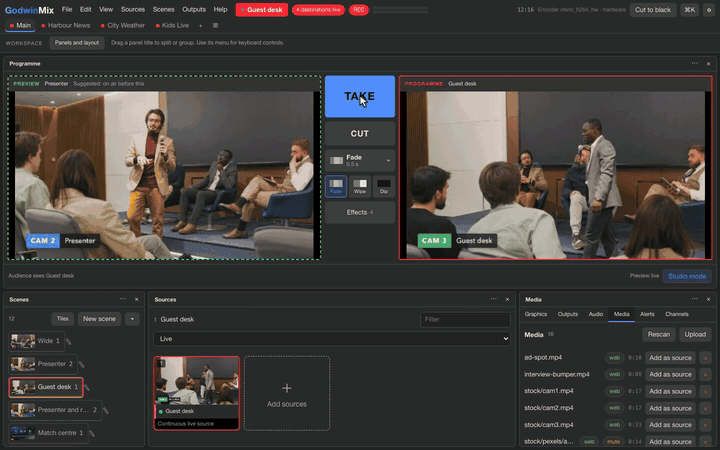</a>
<b>Roll a sponsor clip, back on cue</b><br>
<sub>Play a clip from the media library and the programme returns to the camera when it ends.</sub>
</td>
</tr>
<tr>
<td valign="top">
<a href="https://godwinmix.ripeflow.com/media/video/add-web-source.mp4">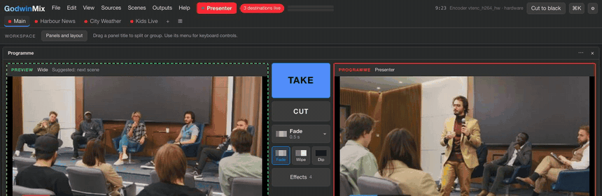</a>
<b>Put any web page on air</b><br>
<sub>Scoreboards, weather, a live dashboard. The page plays with its own picture and sound.</sub>
</td>
<td valign="top">
<a href="https://godwinmix.ripeflow.com/media/video/agent-and-remote.mp4">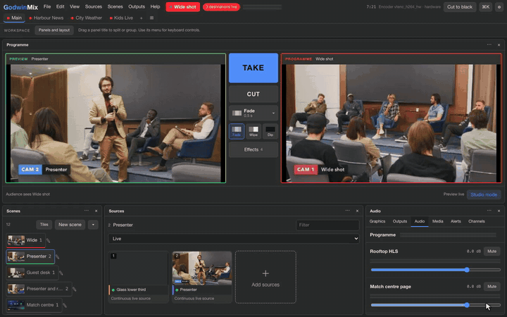</a>
<b>Let an AI agent direct the show</b><br>
<sub>Connect Claude Code, Codex or another agent from the Help menu, then ask in plain words.</sub>
</td>
</tr>
</table>

## Find your way in

| You are | Start here |
|---|---|
| A church media team, a teacher, a club or a small event crew | [Download the app](https://github.com/psmux/GodwinMix/releases/latest), then [your first stream](docs/tutorials/first-stream-desktop.md) |
| Coming from OBS | [Bring your OBS scene collection across](docs/how-to/import-from-obs.md) |
| Running shows with a team or a Stream Deck | [Several operators](docs/how-to/operate-with-several-people.md), [Companion and Stream Deck](docs/how-to/companion-and-streamdeck.md), [OSC and tally](docs/how-to/osc-and-tally.md) |
| Running it on a server or a Raspberry Pi | [Run it on a server](#run-it-on-a-server), [headless server](docs/how-to/headless-server.md), [Raspberry Pi](docs/how-to/raspberry-pi.md) |
| Scripting it | [Drive it from the command line](#drive-it-from-the-command-line) |
| Building with AI agents | [Hook it to an AI agent](#hook-it-to-an-ai-agent) |
| A developer who wants to embed or extend it | [Build on it](#build-on-it) |

## Run it on a server

One container, one port, no screen needed. This puts a web page on air to a local RTMP server, so it needs no stream key to try. CI times it on every push.

```sh
git clone https://github.com/psmux/GodwinMix && cd GodwinMix
docker compose -f deploy/docker/docker-compose.yml up -d --build
```

Open <http://localhost:8080> for the mixer and <http://localhost:8888/live/program> to watch what goes out. To stream somewhere real:

```sh
docker run -d --name godwinmix --shm-size 1g \
  -p 127.0.0.1:8080:8080 -e GODWINMIX_TOKEN=change-me \
  ghcr.io/psmux/godwinmix:latest
```

The full Docker walk through is [your first stream with Docker](docs/tutorials/first-stream-docker.md). Before the port is reachable from anywhere else, read [deploy/README.md](deploy/README.md) for the token, TLS and the firewall.

## Drive it from the command line

Everything the window does is one call, and `gmx` is the short command for it.

```sh
gmx ctl status
gmx ctl source add roof https://host/stream.m3u8 --name "Roof camera"
gmx ctl output add youtube rtmp://a.rtmp.youtube.com/live2/KEY
gmx ctl take roof
```

<p align="center">
  <a href="https://godwinmix.ripeflow.com/media/video/agent-director.mp4">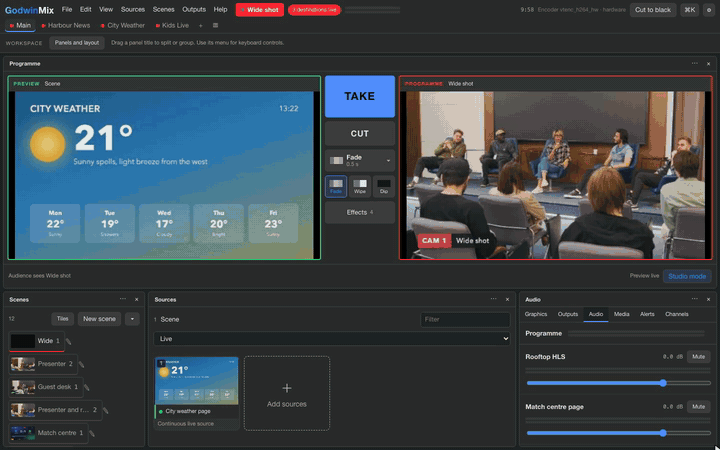</a>
</p>

Every command is in the [CLI reference](docs/reference/cli.md) and every endpoint in the [HTTP API reference](docs/reference/http-api.md).

## Hook it to an AI agent

GodwinMix speaks MCP. With the app open on the same machine, your agent needs no address and no token.

```sh
claude mcp add godwinmix -- godwinmix mcp
godwinmix skill install --for claude     # or opencode, pi, codex, gemini
```

Or skip the terminal: **Help > Connect an AI agent** in the app has a Set up button for Claude Code, opencode, pi, Codex, Gemini CLI, Cursor and VS Code.

<p align="center">
  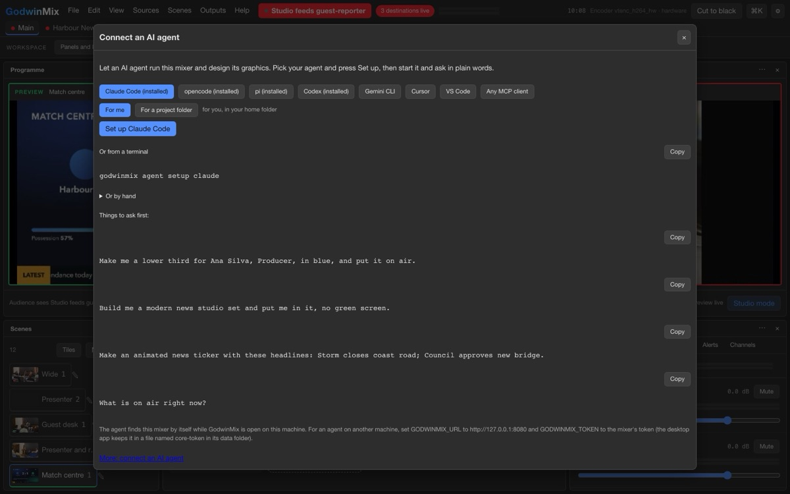
</p>

Then just ask:

> Make me a lower third for Ana Silva, Producer, in blue, and put it on air.

> Take the presenter with a dip through black, then put the scoreboard up at half time.

> When the guest's phone comes online, take her scene with a fade.

The agent sees the whole show in one labelled picture, every camera plus the programme, so it compares shots in a single look.

<p align="center">
  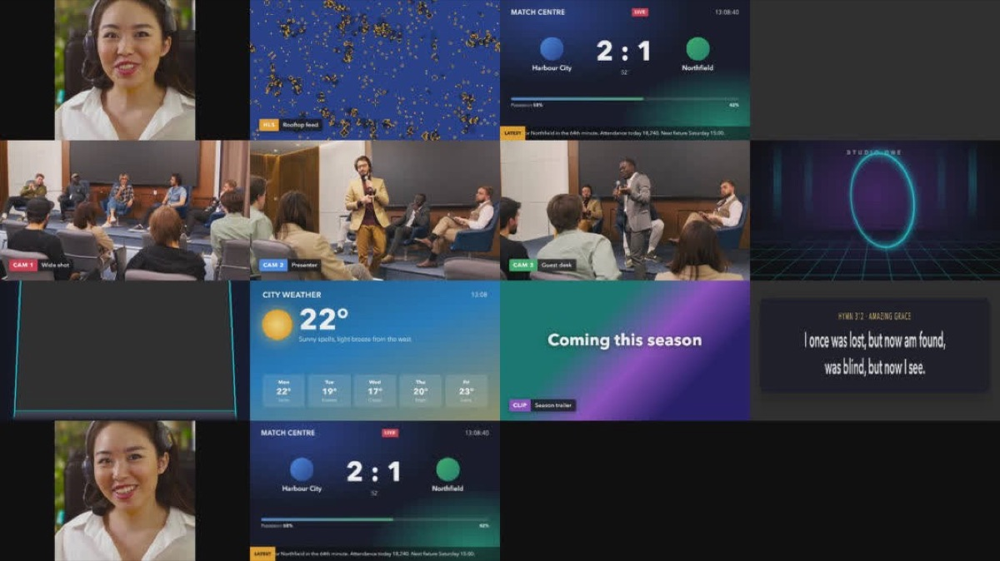
</p>

The playbook for agents, with the decision loop and timings, is [docs/agents.md](docs/agents.md). A working director built on the Anthropic SDK is in [examples/ai-director.py](examples/ai-director.py). Setup per agent: [connect an AI agent](docs/how-to/connect-an-ai-agent.md).

## Build on it

GodwinMix is one Rust binary on GStreamer. The same binary is the server, the CLI and the MCP server, and the web UI uses the same public API as everyone else. There is no private door.

* **Embed the engine** in your own program with `cargo add godwinmix-core`: [how to embed it](docs/how-to/embed-the-engine.md).
* **Write a plugin** that runs beside the core: [your first plugin](docs/tutorials/your-first-plugin.md), scaffolded by `gmx plugin new`.
* **Theme the UI** with CSS variables: [add a theme](docs/how-to/add-a-theme.md).
* **Trust the contract.** API level 1 is frozen for breaking changes, and an old level stays supported for a year after a new one.

Start with [CONTRIBUTING.md](CONTRIBUTING.md) and the [architecture](docs/explanation/architecture.md).

## Why the stream never drops

The part that sends your picture out starts once and runs until the show ends. Everything you do during the show happens in front of it, so YouTube never sees a reconnect. A black slate and silence always sit underneath, so a dead camera shows the slate and the stream keeps its frame rate.

Measured against two independent RTMP servers: exactly 30 frames a second through every take, no disconnects from the server's own logs, and a dropped output back in about 2 seconds. The whole test record, the pipeline and the platforms are in [technical details](docs/technical-details.md) and [why the programme never stops](docs/explanation/why-the-programme-never-stops.md).

## Documentation

| | |
|---|---|
| [Tutorials](docs/tutorials/) | your first stream on the desktop, in a browser, with Docker or from a preset |
| [How to](docs/how-to/) | one task each: graphics, guests, ad breaks, screen capture, NDI, SRT, monitoring many shows |
| [Reference](docs/reference/) | sources, the HTTP API, the CLI, plugins, presets |
| [Explanation](docs/explanation/) | why GodwinMix is built the way it is |
| [Technical details](docs/technical-details.md) | install paths in depth, verification, hardware, platforms and known limits |

## Licence

Apache 2.0, in [LICENSE](LICENSE). Contributions are under the
[CLA](CLA.md) and the [code of conduct](CODE_OF_CONDUCT.md). Security reports
go to the address in [SECURITY.md](SECURITY.md), not to a public issue.

GodwinMix is not affiliated with, endorsed by or connected to the OBS Project.
OBS, OBS Studio, Open Broadcaster Software and the OBS Studio logo are
registered trademarks of Wizards of OBS LLC, and are used here only to describe
what this software reads.

Upgrading from LiveboxMix, which is what this was called until 0.2:
[docs/how-to/upgrade-from-liveboxmix.md](docs/how-to/upgrade-from-liveboxmix.md).
